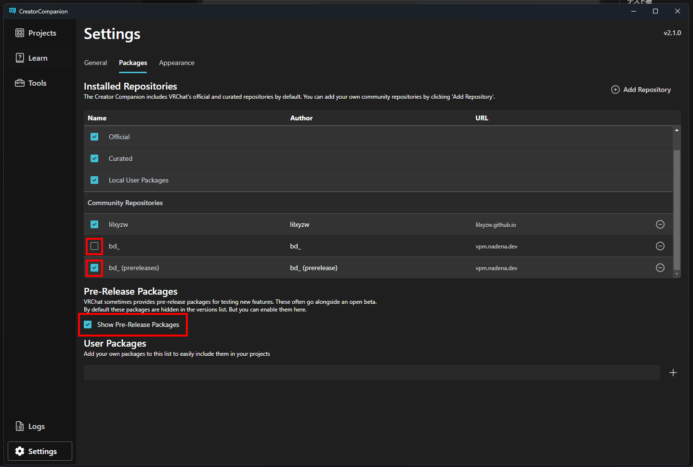

# Modular Avatar

Modular Avatar 是非破壞性（不需更改原本的 Avatar 檔案）的 Avatar 與配件的製作輔助集成工具。
利用 Modular Avatar 製作出來的道具等可直接拖移到 Avatar 即可安裝完成！

Modular Avatar 提供了不同的功能於各個元件﹐可以根據需要再加入需要的元件。自動合併服裝等，或是為不同的資源建立 Animator ，等等提供了許多的功能來輔助 Avatar 製作。

## 安裝

建議從 VRChat Creator Companion（VCC）來安裝 Modular Avatar 。安裝完VCC後﹐請點下方的連結。
* [加入Modular Avatar到VCC](vcc://vpm/addRepo?url=https://vpm.nadena.dev/vpm.json)

加入完成後﹐開啟 Project 的"manage project",點擊右方的＋來追加Modular Avatar。

如果要更新最新版本的Modular Avatar，點擊右方的"Latest Version"進行更新。

安裝完成後可以參考以下的教學。
* [簡單的服裝設定](/docs/tutorials/clothing)
* [複雜的服裝設定](/docs/tutorials/adv_clothing)
* [利用Animator製作切換開關](/docs/tutorials/object_toggle/)
* [製作選單](/docs/tutorials/menu/)

## 測試版

要透過VCC來安裝測試版本的Modular Avatar，[點擊這裡加入測試版](vcc://vpm/addRepo?url=https://vpm.nadena.dev/vpm-prerelease.json)

開啟VCC的設定頁面裡的Packages分頁，將`bd_`的Repositories勾選取消後，再將`bd_ prerelease`的Repositories與`Show pre-release packages`勾選開啟。

測試版的說明書在[這裡](https://modular-avatar.nadena.dev/dev)。

測試版因為是開發中的版本，可能會出現錯誤，或可能更改導致與現行版本不相容的可能性。
錯誤報告或回饋等，請到[GitHub issue](https://github.com/bdunderscore/modular-avatar/issues)。